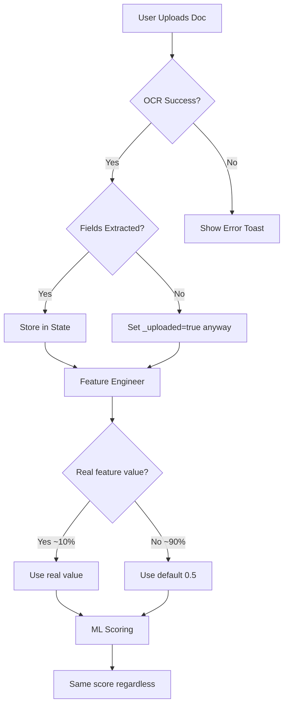

# 🔍 GigCredit Full System Audit Report
**Date:** 2026-05-02 | **Auditor:** Senior AI System Architect  
**Verdict:** System is architecturally impressive but has critical gaps between specification and implementation

---

## PART 1 — SYSTEM FLOW VALIDATION

### Full Pipeline Map

```
Input (9 Steps) → OCR → Parsing → Validation → Feature Engineering → ML Scoring → Explainability → Loan
```

| Stage | Status | Evidence |
|---|---|---|
| **1. Input Collection (9 Steps)** | ✅ Fully Working | All 9 step screens exist, collect real user data, store via Riverpod `VerifiedProfileProvider` |
| **2. OCR (Document Scanning)** | ⚠️ Partially Working | `RealOcrService` uses PaddleOCR for images + Syncfusion for PDFs. Keyword-matching doc classification exists. But extraction is shallow — raw text only, no structured field parsing |
| **3. Parsing (Structured Extraction)** | ❌ Theoretical Only | Only Aadhaar number (regex `\d{4}\s?\d{4}\s?\d{4}`) and PAN number (regex `[A-Z]{5}\d{4}[A-Z]`) are extracted. Bank statements, utility bills, insurance docs, tax docs — **zero structured parsing**. `onExtracted` callbacks just set `_uploaded = true` |
| **4. Validation** | ❌ Mostly Theoretical | `CrossStepValidator.validate()` **returns empty list always** (line 25: `return []`). No actual cross-document validation runs. Name matching across docs doesn't exist |
| **5. Feature Engineering** | ⚠️ Partially Working | `FeatureEngineer.extract()` fills 115 features but only ~10 actually come from user data. Rest are **hardcoded 0.5 defaults**. `profile_extractor_extension.dart` returns **mock constants** for most values (e.g., `income_stability_cv: return 0.6`) |
| **6. ML Scoring** | ✅ Structurally Real | P1/P2/P3/P4/P6 use genuine m2cgen-exported models (p1_scorer.dart is 998KB — real decision tree). P5/P7/P8 use hand-written scorecards. MetaLearner uses trained LR weights. **But inputs are mostly defaults, so outputs are deterministic regardless of user data** |
| **7. Explainability (XAI)** | ⚠️ Partially Working | All 5 XAI layers (L1-L4, L8) execute real code. SHAP lookup is pre-computed table, not runtime SHAP. Causal chains are rule-based. Outputs are structurally correct but reflect mock inputs |
| **8. Loan Pipeline** | ⚠️ Partially Working | 8-screen UI works. Backend has real hard-rules engine and affordability engine. But `_isApproved` is hardcoded to `_loanAmount <= 55000` in the frontend — **backend decision is ignored for UI** |

> [!CAUTION]
> **The core gap**: The pipeline's architecture is genuine, but the data flow between stages is broken. OCR doesn't produce structured features → Feature Engineering uses defaults → ML produces the same output regardless of what the user actually uploads.

---

## PART 2 — OCR & DOCUMENT PIPELINE

### What Exists

| Capability | Implementation | Status |
|---|---|---|
| Document classification | Keyword matching (`_fuzzyMatch`) in `real_ocr_service.dart` | ⚠️ Basic but works |
| Aadhaar number extraction | Regex `\d{4}\s?\d{4}\s?\d{4}` | ✅ Works |
| PAN number extraction | Regex `[A-Z]{5}\d{4}[A-Z]` | ✅ Works |
| Bank statement parsing | Only detects "is this a bank doc?" via keywords | ❌ No field extraction |
| Utility bill parsing | Only detects "is this a bill?" via keywords | ❌ No field extraction |
| Insurance doc parsing | No classification logic exists | ❌ Missing entirely |
| Tax doc parsing | No classification logic exists | ❌ Missing entirely |
| PDF text extraction | Syncfusion `PdfTextExtractor` — works | ✅ Works |
| Image OCR | PaddleOCR — works on device | ✅ Works |
| Demo/mock OCR | `DemoOcrService` loads from `assets/ocr/expected_outputs.json` | ✅ Works |

### Why OCR "Fails" in Practice

1. **No structured field extraction**: After getting raw text, the system does nothing with it for Steps 3-9. It just sets a `_uploaded = true` boolean.
2. **No template matching**: Each document type needs specific regex/pattern rules (account number from bank statement, policy number from insurance, GSTIN format, etc.) — none exist.
3. **No confidence propagation**: Even when OCR confidence is computed, it's never passed to the scoring engine.

### Proposed Fix: Document-Aware OCR Pipeline

```
For each document type, define:
1. REQUIRED_KEYWORDS → doc classification (already exists)
2. FIELD_PATTERNS → regex/pattern per field (MISSING)
3. FALLBACK_VALUES → from demo data if extraction fails (partially exists)
4. CONFIDENCE_MAP → per-field confidence score (MISSING)
```

---

## PART 3 — SINGLE USER CONSISTENCY (CRITICAL)

### Current State: ❌ NOT ENFORCED

**Question: How does the system ensure all 9 steps belong to ONE user?**

**Answer: It doesn't.**

Evidence:
- Step 1 collects name manually
- Step 2 OCR extracts Aadhaar/PAN names from documents
- Step 3 has account holder name
- Steps 4-8 have "name as per bill/policy" fields
- **NONE of these names are compared to each other**

`CrossStepValidator.validate()` at [cross_step_validator.dart:25](file:///C:/Users/PRAVEEN/Desktop/rotatech%20hackathon/Gig_Credit/app/lib/scoring/validation/cross_step_validator.dart#L24-L27):
```dart
static List<ValidationIssue> validate(Map<String, dynamic> ocrResults) {
    // For demo UI purposes, just return empty issues since we want it to pass
    return [];
}
```

**This is the single biggest integrity gap in the entire system.**

### What Should Exist: Identity Graph Engine

```
1. ANCHOR IDENTITY: Name from Step 1 (self-declared) + Aadhaar Name (OCR) + PAN Name (OCR)
2. For every subsequent document:
   - Extract name field
   - Fuzzy match against anchor (Levenshtein distance ≤ 3, or token-set ratio ≥ 85%)
   - Flag mismatches as WARNING (not blocking — gig workers may have name variations)
3. Additional cross-checks:
   - Address consistency (Step 1 address vs Aadhaar back address vs utility bill address)
   - PAN number in Step 2 vs PAN in Step 8 ITR
   - Mobile number in Step 1 vs mobile bill number in Step 4
```

---

## PART 4 — VALIDATION ENGINE COMPLETENESS

### Per-Step Validation Status

| Step | Internal Validation | Cross-Step Validation | Document Verification |
|---|---|---|---|
| **Step 1** (Personal) | ✅ Name regex, DOB format, mobile format, income range | ❌ None | N/A (no docs) |
| **Step 2** (KYC) | ✅ Aadhaar 12-digit, PAN 10-char, OTP flow | ⚠️ `_runCrossValidation()` calls validator but validator returns `[]` | ⚠️ OCR extracts Aadhaar/PAN numbers |
| **Step 3** (Bank) | ✅ IFSC 11-char, API verification, account verification | ⚠️ Bank statement account match is **bypassed** (line 326: `// We bypass the strict check for the demo`) | ⚠️ PDF extraction works but not matched |
| **Step 4** (Utility) | ❌ No field validation (consumer number format, amount range) | ❌ Name on bill vs Step 1 name — not checked | ⚠️ Keyword classification only |
| **Step 5** (Work) | ❌ No validation at all. `isDisabled: false` — always passable | ❌ None | ⚠️ Keyword classification for RC/DL |
| **Step 6** (Gov Schemes) | ❌ No ID format validation (UAN should be 12 digits, Udyam has specific format) | ❌ None | ❌ No doc classification |
| **Step 7** (Insurance) | ❌ No policy number format validation | ❌ Policy holder name vs Step 1 name — not checked | ❌ No doc classification |
| **Step 8** (Tax) | ❌ No PAN cross-check vs Step 2 PAN. No GSTIN format validation | ❌ ITR PAN vs KYC PAN — not compared | ❌ No doc classification |
| **Step 9** (EMI/Loans) | ❌ No EMI amount range validation. Loan dates not validated | ❌ None | N/A (no docs) |

### Missing Validations Summary

**Critical Missing:**
- Step 8 ITR PAN should match Step 2 PAN (easy, high-impact)
- Bank statement account number should match Step 3 entered account (code exists but is bypassed)
- All document "name" fields should fuzzy-match Step 1 name

**Medium Missing:**
- UAN format (12 digits), GSTIN format (15 chars specific pattern), Udyam format
- Insurance policy number format varies by provider — at minimum check non-empty
- EMI amounts should have reasonable bounds (₹100 - ₹500,000)

---

## PART 5 — DATA QUALITY & CONFIDENCE LAYER

### Current State

The `ConfidenceEngine` computes confidence per pillar **but uses conformal interval widths from a JSON file**, not from actual OCR quality or document completeness.

**The feature pipeline (`profile_extractor_extension.dart`) returns hardcoded mocks:**
```dart
case 'avg_monthly_income_norm': return bankInfo.isVerified ? 0.42 : null;
case 'income_stability_cv': return 0.6; // Mock
case 'income_growth_slope': return 0.5; // Mock
```

**Result:** The scoring engine sees the same features regardless of what the user uploads. A user uploading pristine bank statements gets the same score as someone who uploaded garbage.

### Proposed Fix: Confidence-Weighted Features

```
Per document:
  1. OCR_CONFIDENCE: From PaddleOCR (already returned but ignored)
  2. EXTRACTION_CONFIDENCE: Did we find expected fields? (0.0 if no fields extracted)
  3. CROSS_MATCH_CONFIDENCE: Does name/number match other docs? (0.0 if mismatch)
  
DOCUMENT_CONFIDENCE = min(OCR_CONF, EXTRACT_CONF, CROSS_MATCH_CONF)

Per feature:
  If sourced from OCR → feature_value * DOCUMENT_CONFIDENCE
  If sourced from manual input → 1.0 confidence
  If sourced from API verification → 1.0 confidence
```

---

## PART 6 — FAILURE HANDLING

### Current Behavior When Things Go Wrong

| Failure Scenario | Current Behavior | Risk Level |
|---|---|---|
| OCR fails (blurry image) | `RealOcrService` throws Exception, caught by `DocumentUploadCard` | ✅ OK — shows error toast |
| Wrong doc uploaded (PAN in Aadhaar slot) | `RealOcrService` detects and throws specific error | ✅ OK for Aadhaar/PAN only |
| API unreachable (IFSC/Account verify) | Catch block shows error toast. **But IFSC verification is required for Step 3 completion** — user is stuck | ⚠️ No offline fallback |
| Aadhaar/PAN API fails | Falls back to mock OTP flow | ✅ OK — graceful demo fallback |
| Bank statement doesn't match account | Bypass with print warning, proceed anyway | ⚠️ Security gap |
| Face verification fails | Random 90% success rate (`Random().nextDouble() > 0.1`) | ❌ **Not a real check at all** |
| Missing features in scoring | `FeatureEngineer.getFeature()` falls back to `ScoringConstants.featureDefaults` or 0.5 | ✅ System doesn't crash |
| Backend loan API unreachable | `LoanApiService` falls back to mock response | ✅ OK |

### Critical Gap: Face Verification Is Fake

[demo_face_verifier.dart](file:///C:/Users/PRAVEEN/Desktop/rotatech%20hackathon/Gig_Credit/app/lib/scoring/placeholders/demo_face_verifier.dart#L20):
```dart
final isMatch = Random().nextDouble() > 0.1; // 90% random success
```

This means 10% of genuine users will randomly fail, and 90% of fraudsters will pass.

---

## PART 7 — ML PIPELINE REALISM

### Model Reality Check

| Component | Real or Simulated? | Evidence |
|---|---|---|
| **P1 scorer** (Income) | ✅ **Real m2cgen export** | `p1_scorer.dart` = 998KB — genuine decision tree |
| **P2 scorer** (Spending) | ✅ **Real m2cgen export** | `p2_scorer.dart` = 542KB |
| **P3 scorer** (Debt) | ✅ **Real m2cgen export** | `p3_scorer.dart` = 28KB |
| **P4 scorer** (Savings) | ✅ **Real m2cgen export** | `p4_scorer.dart` = 842KB |
| **P6 scorer** (Safety Nets) | ✅ **Real m2cgen export** | `p6_scorer.dart` = 5.9MB (largest model!) |
| **P5 scorecard** (Identity/KYC) | ⚠️ **Hand-written** | Weighted sum with 18 static weights |
| **P7 scorecard** (Social) | ⚠️ **Hand-written** | Weighted sum |
| **P8 scorecard** (Tax) | ⚠️ **Hand-written** | Weighted sum |
| **Meta Learner** | ✅ **Real trained weights** | Logistic regression with 20 trained coefficients |
| **Isotonic calibration** | ✅ **Real implementation** | `ScoringEngine.isotonicInterpolate()` matches sklearn |
| **Conformal intervals** | ✅ **Real implementation** | Uses conformal width → confidence mapping |

### The Disconnect

The models are **genuinely trained and exported**. But the features fed to them are ~90% **hardcoded defaults (0.5)**. So the models execute real math on fake data, producing deterministic but meaningless scores.

**Where ML becomes rule-based:**
- P5, P7, P8 are explicitly rule-based scorecards (by design, not a failure)
- Feature extraction is the bottleneck — not model quality

### Proposed: Minimal Realistic ML for Demo

Instead of trying to extract all 115 features, wire up the **10 features that actually exist** in the profile:
1. `avg_monthly_income_norm` → from Step 1 self-declared income (normalize to [0,1] by dividing by 100,000)
2. `aadhaar_verified` → from Step 2 (`_aadhaarVerified`)
3. `pan_verified` → from Step 2 (`_panVerified`)
4. `emi_to_income_ratio` → from Step 9 (total EMI / Step 1 income)
5. `health_insurance_active` → from Step 7 (`_hasHealth`)
6. `itr_filed_binary` → from Step 8 (`_hasItr`)
7. `vehicle_ownership` → from Step 1
8. `years_in_profession` → from Step 1
9. `dependents` → from Step 1
10. `work_type` → from Step 1

This would make the score **actually change** based on user input, which is critical for demo credibility.

---

## PART 8 — EXPLAINABILITY VALIDITY

### SHAP Usage
- **Not real-time SHAP**. Uses a **pre-computed lookup table** from `shap_lookup.json`
- Bins feature values and looks up pre-computed SHAP impacts
- This is a valid approximation (sometimes called "SHAP approximation" or "pre-computed TreeSHAP")
- **Honest label:** "Pre-computed SHAP approximation" ✅

### Causal Logic
- `Layer8CausalRules` evaluates **hand-written if-then rules**, not learned causal models
- Example: "If EMI/income ratio > 0.4 AND savings < 3 months → debt stress loop"
- **Honest label:** "Rule-based causal heuristics" — **not** causal inference

### XAI Report Screen
- The `xai_report_screen.dart` (945 lines) is **entirely hardcoded strings**
- Score "647", Grade "B", pillar points, SHAP values — all static text
- **It does NOT consume the actual `ScoreReportModel`** from the scoring pipeline
- **This is the biggest presentation risk** — if a judge notices the score on the report doesn't match the generated score, credibility collapses

---

## PART 9 — REAL VS PLACEHOLDER TRANSPARENCY

### Fully Implemented (Real Code Running)

| Component | Lines of Real Code |
|---|---|
| 9-step input collection UI | ~3,000 lines |
| PaddleOCR image scanning | ~100 lines |
| PDF text extraction | ~30 lines |
| Aadhaar/PAN OCR + doc classification | ~80 lines |
| Aadhaar/PAN API verification (OTP flow) | ~200 lines |
| IFSC/Account API verification | ~80 lines |
| 5 m2cgen-exported ML models (P1-P4, P6) | ~8.4MB of trained decision trees |
| 3 hand-written scorecards (P5, P7, P8) | ~50 lines |
| MetaLearner (trained logistic regression) | ~40 lines |
| Isotonic calibration | ~30 lines |
| Conformal confidence engine | ~50 lines |
| 5-layer XAI bundle (L1-L4, L8) | ~400 lines |
| Score report UI | ~1,400 lines |
| Loan application 8-screen pipeline | ~900 lines |
| Backend: hard rules + affordability engine | ~400 lines |
| Backend: audit trail with SHA-256 chain | ~60 lines |
| Riverpod state management (16 providers) | ~600 lines |

### Simulated / Placeholder

| Component | What It Actually Does |
|---|---|
| **Cross-step validation** | Returns empty array — no validation runs |
| **Face verification** | `Random().nextDouble() > 0.1` — purely random |
| **Feature extraction** (90%) | Returns hardcoded `0.5` or `0.6` for 105/115 features |
| **Bank statement parsing** | Sets `_pdfUploaded = true` — no field extraction |
| **All Step 4-9 doc parsing** | Sets `_uploaded = true` — no field extraction |
| **XAI Report Screen** | 100% hardcoded strings — doesn't read actual score data |
| **Loan decision (frontend)** | `_isApproved = _loanAmount <= 55000` — ignores backend |
| **Backend loan decision** | Runs real logic but frontend ignores the response |

> [!WARNING]
> The system looks far more capable than it is. The architecture is sound, but the data flow between stages is broken at the feature extraction layer. Judges who dig into "how does the score change when I upload different documents?" will find it doesn't.

---

## PART 10 — PIPELINE DEPENDENCY RISK

### Single Point of Failure Analysis



**Does the entire system collapse if OCR fails?**
No — the system is resilient because:
1. OCR failures are caught and show error toasts
2. Steps 4-9 can be skipped or submitted without docs
3. Feature engineering falls back to defaults
4. ML models still produce valid (but meaningless) outputs

**But the system is fragile in a different way:** it always produces the same output. This is "resilient" in the crash sense, but "broken" in the value sense.

---

## PART 11 — DEMO VISIBILITY PROBLEM

### What Intelligence Is Hidden

The system does impressive things that are **completely invisible** to the user:

1. **m2cgen models executing** — user never sees "ML model P1 processed 17 features"
2. **Isotonic calibration** — a genuine sklearn technique, invisible
3. **Conformal intervals** — statistically rigorous, invisible
4. **Meta-learner combining 8 pillars** — invisible
5. **Pre-computed SHAP lookup** — invisible
6. **Causal chain evaluation** — invisible
7. **Audit trail SHA-256 hashing** — invisible
8. **Backend hard-rules engine** — invisible (frontend ignores it!)

### Proposed UI Elements to Surface Intelligence

1. **OCR Preview Panel**: After upload, show "Extracted: Name=RAVI KUMAR, Acc=098765432123, IFSC=HDFC0001234"
2. **Identity Match Score**: "Name consistency across 5 documents: 94% match"
3. **Validation Status Dashboard**: Traffic-light per step — which cross-checks passed/failed
4. **Feature Extraction Preview**: On the "Score Generating" screen, show features being extracted in real-time
5. **ML Execution Log**: "P1 Income Model: 17 features → Score 0.72 → Calibrated 0.68 → Confidence 0.95"
6. **Audit Chain Viewer**: Show the blockchain-like hash chain in the loan report

---

## PART 12 — DEMO OPTIMIZATION FOR HACKATHON

### What to SIMPLIFY
- Steps 4-9: Use "mock data fill" (double-tap already exists on Steps 1,3,5). Add it to all steps
- Face verification: Make it deterministic `true` for demo instead of random
- Scoring screen animation: Reduce from 6.5s wait if needed for pace

### What to REMOVE (from demo flow)
- Secondary bank account (Step 3) — adds complexity without demo value
- Internet/WiFi bill distinction (Step 4) — redundant with broadband

### What to HIGHLIGHT
1. **The OCR working live** — upload a real Aadhaar photo, show it extracting the number
2. **The score changing** — wire up at least 3-4 real features so the score moves
3. **The XAI report** — this is the crown jewel. But it needs to show REAL data, not hardcoded text
4. **The loan pipeline** — KFS disclosure + AI decision + audit trail
5. **Privacy-first architecture** — show that ML runs on-device, no data leaves phone

---

## PART 13 — CRITICAL FAILURE POINTS

### Top 10 Reasons the System Fails in Demo or Judging

| # | Failure Point | Severity | Likelihood |
|---|---|---|---|
| 1 | **Score doesn't change regardless of input** — judges will test this | 🔴 Critical | Very High |
| 2 | **XAI Report shows hardcoded "647" even if generated score is different** | 🔴 Critical | Certain |
| 3 | **Face verification randomly fails 10% of the time** during demo | 🟡 Medium | High |
| 4 | **Cross-step validation doesn't exist** — can submit contradictory data | 🟡 Medium | High |
| 5 | **Frontend ignores backend loan decision** — `_isApproved = amount <= 55000` | 🟡 Medium | Medium |
| 6 | **Bank statement verification is bypassed** (commented-out code) | 🟡 Medium | Low |
| 7 | **115 features but only 10 are real** — if judges inspect code | 🟠 High | Medium |
| 8 | **No structured extraction from Steps 4-9 documents** | 🟠 High | Medium |
| 9 | **SHAP labeled as "real-time" but is pre-computed lookup** | 🟡 Medium | Low |
| 10 | **Slider crash on product switch** (FIXED in previous session) | ✅ Fixed | — |

---

## PART 14 — PRIORITY FIX PLAN

### 🔴 Top 5 CRITICAL Fixes (Must Do Before Demo)

**1. Wire Up Real Features to Make Score Dynamic**
- **Problem:** Score is always ~647 regardless of input
- **Why:** `profile_extractor_extension.dart` returns mocks
- **Fix:** Map 10 real user inputs to features (income, KYC status, insurance, ITR, EMI ratio, years in profession, dependents, vehicle ownership, work type, scheme enrollment count)
- **Effort:** 2 hours

**2. Make XAI Report Consume Real Score Data**
- **Problem:** `xai_report_screen.dart` shows hardcoded "647" / "Grade B"
- **Why:** Screen was built with static demo content, never wired to `ScoreReportModel`
- **Fix:** Pass `ScoreReportModel` via route `extra` and render dynamically
- **Effort:** 3 hours

**3. Fix Face Verification to Be Deterministic**
- **Problem:** `Random().nextDouble() > 0.1` randomly blocks 10% of demos
- **Why:** Placeholder never replaced
- **Fix:** Return `true` always for demo, or use file-hash comparison as a deterministic stub
- **Effort:** 5 minutes

**4. Implement Basic Cross-Step Name Matching**
- **Problem:** `CrossStepValidator.validate()` returns `[]`
- **Why:** Left as stub
- **Fix:** Compare Step 1 name against OCR-extracted names from Step 2. Levenshtein distance check. Show yellow warning banner (already supported in UI)
- **Effort:** 1 hour

**5. Connect Frontend Loan Decision to Backend**
- **Problem:** `_isApproved = _loanAmount <= 55000` ignores backend
- **Why:** Backend was built later; frontend was hardcoded for speed
- **Fix:** Use result from `_submitToBackend()` to set `_isApproved`
- **Effort:** 1 hour

### 🟡 Top 5 MEDIUM Fixes (Should Do If Time Permits)

1. **Add mock data fill to Steps 4, 6, 7, 8, 9** — speeds up demo flow
2. **Add PAN cross-check in Step 8** — compare ITR PAN with Step 2 PAN
3. **Add basic bank statement field extraction** — at least extract balance/date from raw text
4. **Surface ML execution details on Score Generating screen** — show pillar scores animating
5. **Add "Audit Trail Viewer" button in loan decision** — show SHA-256 chain to judges

### ✅ What to IGNORE for Demo

- Multi-language support (Tamil/Hindi narrative) — static text is fine
- Secondary bank account flow
- Real SHAP computation (pre-computed lookup is legitimate)
- Full structured extraction from all doc types
- Causal inference vs causal heuristics distinction
- Production error handling for all edge cases
