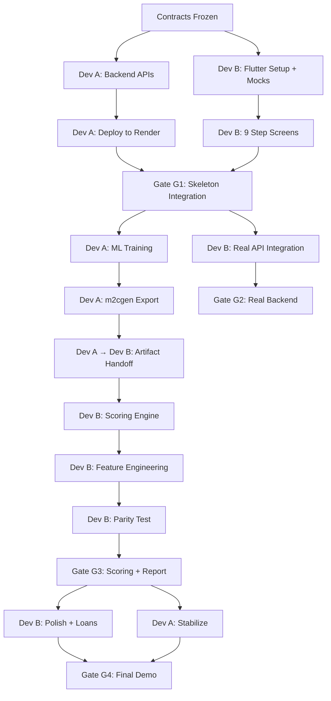

# ================================================================================
# GIGCREDIT — TIMELINE AND DEPENDENCY MAP
# Document 31 | planning_new
# ================================================================================

## 1. 48-HOUR VISUAL TIMELINE

```
Hour:  0    4    8    12   16   20   24   28   32   36   40   44   48
       │    │    │    │    │    │    │    │    │    │    │    │    │
       │◄─P1─►│    │    │    │    │    │    │    │    │    │    │
       │    │◄──── P2 ────►│    │    │    │    │    │    │    │
       │    │    │    │    │◄─── P3 ────►│    │    │    │    │
       │    │    │    │    │    │    │◄─── P4 ────►│    │    │
       │    │    │    │    │    │    │    │    │◄── P5 ──►│    │
       │    │    │    │    │    │    │    │    │    │    │◄P6►│
       │    │    │    │    │    │    │    │    │    │    │    │◄P7►
       │    │    │    │    │    │    │    │    │    │    │    │    │
       G0   │    │    G1   │    G2   │    │    G3   │    │    G4
       ↑    │    │    ↑    │    ↑    │    │    ↑    │    │    ↑
   Contract │    │ Skeleton│   Real │    │  Scoring │    │  DEMO
   Freeze   │    │ Integr  │  Backend│    │  + Report│    │  READY
```

---

## 2. DEPENDENCY CHAIN



---

## 3. CRITICAL PATH

The critical path determines the MINIMUM time to deliver:

```
Contracts (2h) → Backend APIs (8h) → Deploy (2h) → ML Training (4h)
→ m2cgen Export (2h) → Handoff (1h) → Scoring Integration (3h)
→ Feature Engineering (3h) → Report (3h) → Polish (4h) → Demo (4h)
= ~36 hours on critical path
```

**Buffer: 12 hours** for debugging, integration issues, and unexpected problems.

---

## 4. PARALLEL WORK STREAMS

| Hour Block | Dev A Working On                | Dev B Working On                  |
|-----------|-------------------------------|--------------------------------------|
| 0–4       | FastAPI + Contracts + MongoDB  | Flutter + Theme + Mocks + Navigation |
| 4–12      | All 13 API endpoints + Seed   | All 9 step screens + Shared widgets  |
| 12–16     | Deploy to Render + Fix bugs   | Real API client + HMAC signer        |
| 16–20     | ML data generation + Training | OCR integration + Bank parser        |
| 20–24     | Complete training + Export     | Connect all steps to real APIs       |
| 24–28     | SHAP + Golden + Meta-learner  | Feature engineering (95 features)    |
| 28–32     | Backend stabilization         | Scoring engine + Meta-learner        |
| 32–36     | LLM prompt optimization       | Report screen + PDF export           |
| 36–40     | Error handling + Monitoring   | Loan marketplace + Polish + Anim     |
| 40–44     | Final backend fixes           | Error states + Branding              |
| 44–48     | JOINT: Demo rehearsal + fixes | JOINT: Demo rehearsal + fixes        |

---

## 5. WHAT IF THINGS GO WRONG — TIME BUDGET

| Issue                        | Time to Fix | Fallback if Can't Fix         |
|------------------------------|-------------|-------------------------------|
| Backend won't deploy         | 2 hours max | Use MockApiClient             |
| ML training bad results      | 1 hour max  | Use weighted-sum scorers      |
| m2cgen export fails          | 1 hour max  | Write manual Dart scorers     |
| Parity test fails            | 1 hour max  | Accept demo-reasonable scores |
| OCR integration fails        | 0 hours     | DemoOcrService (always ready) |
| Groq API key invalid         | 30 min max  | Use fallback templates        |
| Merge conflict               | 1 hour max  | Both devs resolve together    |
| App crashes on release build | 2 hours max | Use debug APK for demo        |
| Internet unavailable at demo | 0 hours     | All mocks + offline scoring   |

---

## 6. HANDOFF SCHEDULE

| Hour | From    | To      | What                                   |
|------|---------|---------|----------------------------------------|
| 4    | Dev A   | Dev B   | contracts/*.json (reviewed + frozen)   |
| 16   | Dev A   | Dev B   | Render URL for backend                 |
| 24   | Dev A   | Dev B   | scorecard_p5.dart, scorecard_p7.dart   |
| 26   | Dev A   | Dev B   | p1_scorer.dart - p4_scorer.dart        |
| 27   | Dev A   | Dev B   | p6_scorer.dart                         |
| 27   | Dev A   | Dev B   | scoring_constants.dart                 |
| 27   | Dev A   | Dev B   | shap_lookup.json, meta_coefficients    |
| 28   | Dev A   | Dev B   | golden_inference.json                  |
| 28   | Dev B   | Dev A   | Parity test results                    |
| 36   | Dev B   | Dev A   | Full integration test report           |
