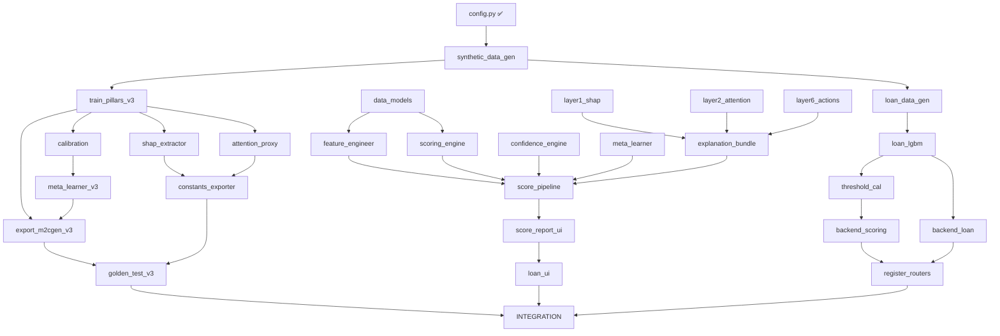

# V3.0 Timeline & Dependency Graph

## Dependency Graph



## Parallel Execution Timeline

```
TIME     DEV A (ML + Backend)                    DEV B (Flutter UI + Integration)
─────    ─────────────────────                    ──────────────────────────────
0:00     A2: synthetic_data_generator.py          B1-B6: Data models (6 files)
         ├ Generate 15K profiles                  ├ ScoreReportModel update
         └ ~15 min compute                        ├ ScorePillarModel update
                                                  ├ ShapFactorModel update
                                                  ├ LoanDecisionModel (new)
                                                  ├ KfsModel (new)
                                                  └ LoanProductModel (new)

0:30     A3: train_pillars_v3.py                  B7: feature_engineer.dart
         ├ Train 5 XGBoost models                 ├ Rename all features
         └ ~10 min compute                        ├ Add P8 (7 features)
                                                  └ Update featureMeans

1:00     A4: calibration.py                       B8: scoring_engine.dart
         ├ Isotonic regression × 5                ├ Add P8 scorer import
         ├ Conformal intervals × 20              ├ Fix P7 slice (78-88)
         └ Output 2 JSON files                    └ Add calibration method

1:15     A5: meta_learner_v3.py                   B9: confidence_engine.dart
         ├ Logistic regression                    B10: meta_learner.dart
         └ Output coefficients JSON               └ Replace XGB with LR

1:30     A6: shap_extractor.py                    B11-B14: Explainability
         ├ TreeSHAP × 5 models                   ├ layer1_shap.dart
         └ ~15 min compute                        ├ layer2_attention.dart
                                                  ├ layer6_actions.dart
                                                  └ explanation_bundle.dart

2:00     A7: attention_proxy.py                   B15: score_pipeline.dart
         A8: export_m2cgen_v3.py                  ├ Rewrite 13-step pipeline
         ├ Generate 5 Dart files                  └ Wire all components
         ├ Generate p7, p8, meta_lr                
         └ dart analyze                            

2:30     A9: constants_exporter.py                B16: Score Report UI (start)
         A10: golden_test_v3.py                   ├ ScoreGaugeWidget
         ├ 100 golden profiles                    ├ PillarRadarChart
         └ Parity verification                    ├ StrengthCard / ConcernCard
                                                  ├ PillarDetailCard
                                                  └ ActionImprovementCard

3:00     A11: loan_data_generator.py              B16: Score Report UI (finish)
         A12: loan_lgbm_trainer.py                ├ Wire data flow
         ├ 50K loan scenarios                     └ Animations
         └ LightGBM training                       

3:30     A13: threshold_calibrator.py             B17-B20: Loan UI (4 screens)
         A14-A16: Backend API                     ├ ProductSelectionScreen
         ├ scoring_router.py                      ├ KfsDisplayScreen
         ├ loan_router.py                         ├ LoanApplicationScreen
         ├ explainability_router.py               └ LoanDecisionScreen
         └ audit_chain.py                          

4:30     A17-A18: Register routers                B21-B23: Services & Nav
         ├ main.py update                         ├ LoanApiService
         └ Test all endpoints                     ├ ScoreApiService
                                                  └ Route registration

5:00     ─── INTEGRATION BEGINS (Dev B leads) ───
         I1: Copy Dart files + JSON assets
         I2: Delete old meta_scorer.dart
         I3: Update pubspec.yaml
         I4: dart analyze
         I5: Golden parity test
         I6: Test backend endpoints
         I7: Wire AssetLoader
         I8: Full smoke test on device
         I9: Final cleanup

6:00     ─── DONE ───
```

## Critical Path
The critical path is:
```
A2 → A3 → A4/A5 → A8 → A10 → INTEGRATION
```
If any step on this path is delayed, the entire project is delayed.

## Parallelism Opportunities
- A6 (SHAP) and A7 (attention) run in parallel with A4/A5
- A11-A13 (loan ML) run in parallel with A8-A10 (export)
- ALL Dev B tasks run in parallel with Dev A tasks
- B16 (Score UI) can start before Dev A finishes (use mock data)
